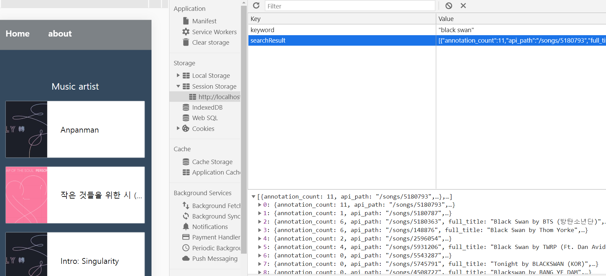

## 가수 및 음악 검색 정적 웹사이트👩‍🎤

-   리액트 컴포넌트 설계 연습을 위한 토이 프로젝트
-   [Genius API](https://docs.genius.com/)의 가수 및 음악 데이터 사용
-   TypeScript 로 코드 작성
-   Webpack / Babel 직접 설정
-   Jest / Enzyme 로 유닛 테스트

 

 

## 페이지

-   `#/` - 메인 화면 , 가수 및 음악 통합 검색 페이지 , 검색 내용은 10개로 제한
-   `#/artist/:id` - 쿼리로 들어오는 id에 따라서 artist 정보 보여줌 , 검색 내용 제한 X , 페이지네이션 구현
-   `#/about` - 어바웃 페이지

 

 

## 컴포넌트 구조

### 1. Home 페이지

 

### 2. Artist 페이지

 

 

## 기능

### 1. 키워드 검색 및 아티스트 페이지

-   검색 후 아티스트 이름 클릭 시, `#/artist/:id` 페이지를 보여준다.

-   아티스트 페이지에는 데이터의 제한이 없으므로 페이지네이션을 구현하여 데이터를 10개씩만 보여주도록 함.

 

### 2. 검색 내용 임시 저장

-   검색창에 작성한 keyword와 결과 데이터를 Session Storage에 저장해줘서, 새로고침하거나 다른 페이지에 갔다와도 검색 내용이 남아있도록 구현

 

### 3. 검색 기록 자동 저장

-   검색 기록을 `localStorage`에 저장한다.
-   검색 기록은 삭제할 수 있다.
-   검색 기록 클릭 시, 해당 키워드 검색 창으로 리다이렉트 해준다.

 

 
